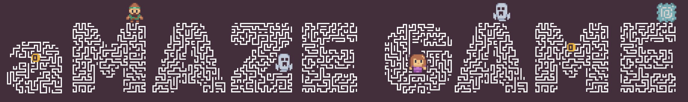

# aMaze game

This game was created for the Master's thesis research to complete the Game Studies and Engineering program at University of Klagenfurt, Austria. The research topic was "The Influence of Title Screen and Main Menu on Player Immersion." 

The game was developed using React JS, TypeScript, and other supporting libraries. The development happened in the period from April 2023 to March 2024.

The game has two versions: one with a title screen and main menu and one without. This repository contains the full version of the game with a title screen and main menu.

For the research purposes, two versions of the game were allocated to the separate branches. These branches were supplied to the [vercel.com](https://vercel.com) and promoted to the production.

| Version             | Branch                                                                                                | Web Page                                                      |
|---------------------|-------------------------------------------------------------------------------------------------------|---------------------------------------------------------------|
| Version A (full)    | [primary/title_menu_tutorial](https://github.com/IPravdin/maze-game/tree/primary/title_menu_tutorial) | [link](https://maze-game-a2y2onhnw-ipravdin.vercel.app/)      |
| Version B (reduced) | [primary/no-menu](https://github.com/IPravdin/maze-game/tree/primary/no-menu)                         | [link](https://maze-game-dp7sovlau-ipravdin.vercel.app/game)  |

## Set Up

To run the game, you need to have Node.js installed on your computer. You can download it from [here](https://nodejs.org/en/). Additionally, you need to install pnpm package manager. You can do that by running the commands from [here](https://pnpm.io/installation).

After you finished with the Node.js and pnpm installation, you can run the following commands in the terminal:

### `pnpm install`
Installs all the dependencies needed to run the game.

### `pnpm start`
Runs the app in the development mode.

## Credits
It would be impossible to create this game without assets and code from the following sources:

| Id | Author                                              | Title                                                                                                                               | Used For                                                 | Licence                                                   | Changes                                                                                                                                                                    |
|----|-----------------------------------------------------|-------------------------------------------------------------------------------------------------------------------------------------|----------------------------------------------------------|-----------------------------------------------------------|----------------------------------------------------------------------------------------------------------------------------------------------------------------------------|
| 1  | Kenney                                              | [1-Bit Pack](https://www.kenney.nl/assets/1-bit-pack)                                                                               | Bonus and Inspiration for Map Cells                      | [CC0](https://creativecommons.org/publicdomain/zero/1.0/) | Map cells was created using the reference to the pack and pack's color scheme                                                                                              |
| 2  | Kenney                                              | [Tiny Dungeon](https://www.kenney.nl/assets/tiny-dungeon)                                                                           | Enemies and Playable Character Sprites (male and female) | [CC0](https://creativecommons.org/publicdomain/zero/1.0/) | Color of Players and Enemies was slightly modified and the original sprite (turned right) from pack is used to create other character poses (left, top, bottom, and dead). |
| 3  | Devression                                          | [Maze-Game](https://github.com/devression/Maze-Game)                                                                                | Maze generator                                           |                                                           | Inspiration for the game's maze generator                                                                                                                                  |
| 4  | Cynicmusic (pixelsphere.org)                        | [Mysterious Ambience (song21)](https://opengameart.org/content/mysterious-ambience-song21)                                          | Menu Soundtrack                                          | [CC BY 3.0](https://creativecommons.org/licenses/by/3.0/) |                                                                                                                                                                            |
| 5  | Cynicmusic (pixelsphere.org), mixed by congusbongus | [Crystal Cave + Mysterious Ambience (seamless loop)](https://opengameart.org/content/crystal-cave-mysterious-ambience-seamless-loop) | Gameplay Soundtrack                                      | [CC BY 3.0](https://creativecommons.org/licenses/by/3.0/) | Converted from .ogg to .mp3 format                                                                                                                                         |
| 6  | GlennM                                              | [right_foot_stone.wav](https://freesound.org/s/386525/)                                                                             | Player Footstep Sound                                    | [CC BY 3.0](https://creativecommons.org/licenses/by/3.0/) | Gain was increased by 10 db                                                                                                                                                |
| 7  | MATRIXXX_                                           | [Retro, Coin 02.wav](https://freesound.org/s/402288/)                                                                               | Coin Pickup Sound                                        | [CC0](https://creativecommons.org/publicdomain/zero/1.0/) | Gain was lowered by 10 db                                                                                                                                                  |
| 8  | HorrorAudio                                         | [Kid Ghost Sigh.wav](https://freesound.org/s/431979/)                                                                               | Enemy Sound                                              | [CC0](https://creativecommons.org/publicdomain/zero/1.0/) |                                                                                                                                                                            |
| 9  | Jobro                                               | [Alien windbells up.wav](https://freesound.org/s/104076/)                                                                           | Teleport Sound                                           | [CC BY 3.0](https://creativecommons.org/licenses/by/3.0/) |                                                                                                                                                                            |
| 10 | Ludist                                              | [soul- death.mp3](https://freesound.org/s/204450/)                                                                                  | Death Sound                                              | [CC BY 3.0](https://creativecommons.org/licenses/by/3.0/) | Gain was increased by 5 db                                                                                                                                                 |